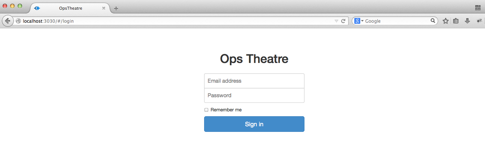

# Vagrant Appliance #

The Vagrant box is a Debian 7 virtual machine image with a pre-configured Puppet Master, PuppetDB and Git repositories for both OpsTheatre backend and frontend. Users will be able to deploy the latest OpsTheatre and try it out without having the need to configure the dashboard and it's dependencies.

## 1. Requirements

* 512M free RAM for the Virtual Machine
* 3 GB of free disk space
* A 32-bit kernel

## 2. Download the Vagrant Box

Download the vagrant box from here: Insert link.

## 3. Download the Vagrant Software
### 3.1 – Download and Install Vagrant

* Follow [this guide](https://www.virtualbox.org/wiki/Downloads) in order to install VirtualBox. (We are using VirtualBox as the provider)
* Follow [this guide](http://www.vagrantup.com/downloads.html) in order to install Vagrant.

### 3.2 - Deploy the Virtual Machine

Run the following commands to get the vagrant up and working:

Import the Vagrant box:

  `$ vagrant box add opstheatre <download path>/ops-theatre.box`
    
    ==> box: Adding box 'ops-theatre' (v0) for provider:
        box: Downloading: file:///Volumes/data/ops-theatre.box
    ==> box: Successfully added box 'ops-theatre' (v0) for 'virtualbox'!
  
Create a Vagrant directory:

  `$ mkdir opstheatre`

Create a Vagrantfile:

  `$ cd opstheatre; vagrant init`

Replace the contents of the Vagrantfile with the following:

    # -*- mode: ruby -*-
    # vi: set ft=ruby :

    VAGRANTFILE_API_VERSION = "2"

    Vagrant.configure(VAGRANTFILE_API_VERSION) do |config|
      config.vm.box = "opstheatre"

      config.vm.provider "virtualbox" do |vb|
        vb.gui = false
      end

      config.vm.define :opstheatre do |ops|
        ops.vm.hostname = 'opstheatre.olindata.com'
        ops.vm.network "private_network", ip: "192.168.56.10"
        ops.vm.network "forwarded_port", guest: 3030, host: 3030
      end
    end

Deploy Vagrant!:

  `$ vagrant up opstheatre`
  
    Bringing machine 'opstheatre' up with 'virtualbox' provider...
    ==> opstheatre: Importing base box 'ops-theatre'...
    ==> opstheatre: Matching MAC address for NAT networking...
    ==> opstheatre: Setting the name of the VM: opstheatre_opstheatre_1411268507306_3678
    ==> opstheatre: Clearing any previously set network interfaces...
    ==> opstheatre: Preparing network interfaces based on configuration...
        opstheatre: Adapter 1: nat
        opstheatre: Adapter 2: hostonly
    ==> opstheatre: Forwarding ports...
        opstheatre: 22 => 2222 (adapter 1)
    ==> opstheatre: Booting VM...
    ==> opstheatre: Waiting for machine to boot. This may take a few minutes...
        opstheatre: SSH address: 127.0.0.1:2222
        opstheatre: SSH username: vagrant
        opstheatre: SSH auth method: private key
        opstheatre: Warning: Connection timeout. Retrying...
    ==> opstheatre: Machine booted and ready!
    GuestAdditions 4.3.16 running --- OK.
    ==> opstheatre: Checking for guest additions in VM...
    ==> opstheatre: Setting hostname...
    ==> opstheatre: Configuring and enabling network interfaces...
    ==> opstheatre: Mounting shared folders...
        opstheatre: /vagrant => /Volumes/data/opstheatre
        

### 3.3 – Start the Appliance

SSH into the Vagrant instance:

  `$ vagrant ssh`
  
    Linux opstheatre 3.2.0-4-486 #1 Debian 3.2.60-1+deb7u3 i686

    The programs included with the Debian GNU/Linux system are free software;
    the exact distribution terms for each program are described in the
    individual files in /usr/share/doc/*/copyright.

    Debian GNU/Linux comes with ABSOLUTELY NO WARRANTY, to the extent
    permitted by applicable law.
    Last login: Wed Sep 17 22:54:48 2014
    vagrant@opstheatre:~$
    

Get sudo access to the instance:

  `$ sudo su -`
  
    vagrant@opstheatre:~$ sudo su -
    root@opstheatre:~#    

Run the following command to deploy OpsTheatre:

`$ /root/setup.sh`

    ##### Updating puppet master host record #####
      ensure => 'present',
      ip     => '10.0.2.15',
      target => '/etc/hosts',
    }
    [ ok ] Starting PostgreSQL 9.1 database server: main.
    [ ok ] Starting web server: apache2.

    ##### Please wait... #####

    ##### Updating git repository for ops-theatre #####
    Already up-to-date.
    
    ##### Starting ops-theatre process #####
    
    ##### Updating git repository for ops-theatre-frontend #####
    Already up-to-date.
    
    ##### Starting ops-theatre-frontend process #####

## 4. Take a Test Drive

Open your browser and insert the URL http://localhost:3030 on the address bar. You will be presented with the OpsTheatre login page.

