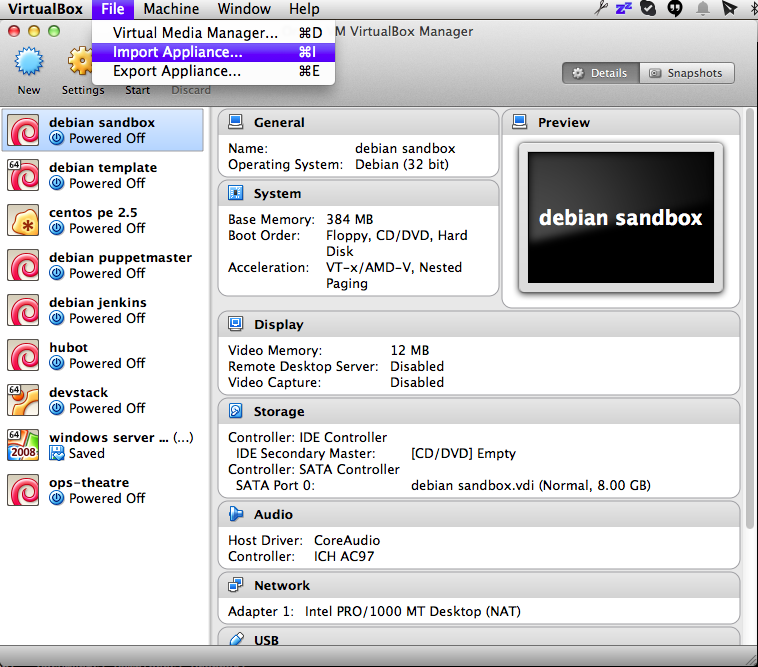
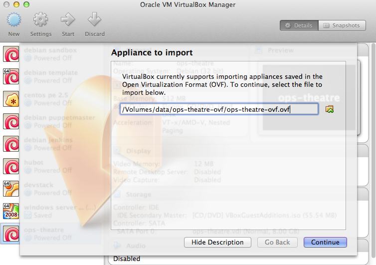
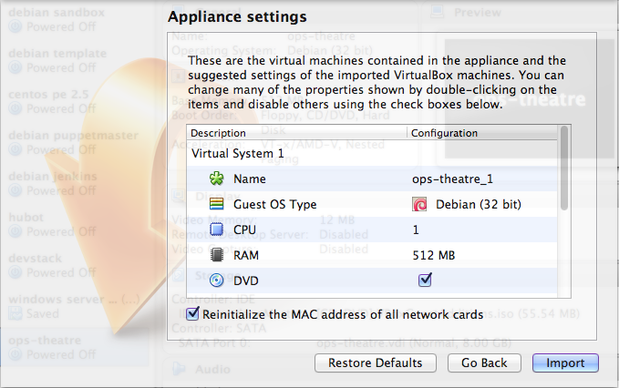
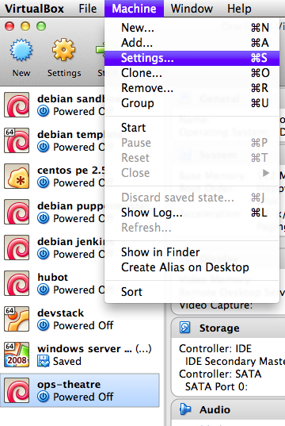
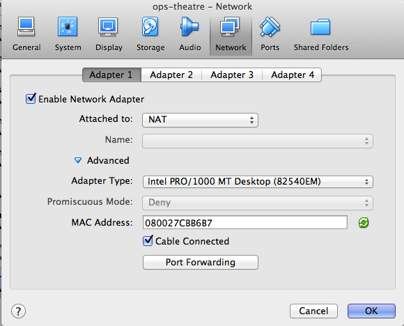
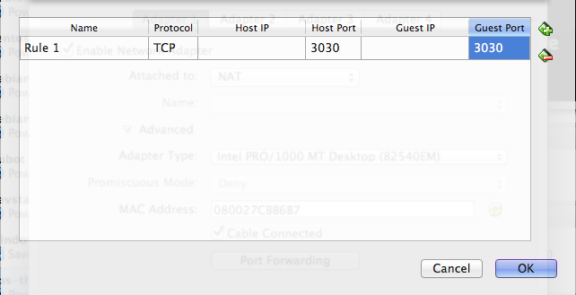

# VirtualBox Appliance #

The appliance is a Debian 7 virtual machine image with a pre-configured Puppet Master, PuppetDB and Git repositories for both OpsTheatre backend and frontend. Users will be able to deploy the latest OpsTheatre and try it out without having the need to configure the dashboard and it's dependencies.

## 1. Requirements

* 512M free RAM for the Virtual Machine
* 3 GB of free disk space
* A 32-bit kernel

## 2. Download the Virtual Appliance

Download the image from here: Insert link.

The image is compressed using zip. Be sure to extract it before moving on.

## 3. Download the VirtualBox Software
### 3.1 – Download and Install VirtualBox

Follow [this guide](https://www.virtualbox.org/wiki/Downloads) in order to install VirtualBox.

### 3.2 - Deploy the Virtual Machine

* Import the virtual appliance by clicking on the Import option from the menu bar.

    
  
  
* Locate the virtual appliance that you have extracted earlier.

    
  
 
* Check the 'Reinitialize the MAC addresses of all network cards' checkbox.

  
  
* Click Import.

* Under Machine → Settings, select the Network option, click on the Advanced arrow, and you will see a Port Forwarding button. Click on it and you will see a dialog appear. Click on the icon that has a green plus sign and fill in **3030** both in the Host Port and Guest Port columns, leave all the other fields in blank.

  
  
  
  
  

### 3.3 – Start the Appliance

Click on the Start button and a Virtual Machine console will pop up. Wait until you see a login prompt that says ”opstheatre login:”

At this point you can log in into the Virtual Machine using the following information:

* Login: root
* Password: opstheatre

Run the following command to deploy OpsTheatre:

`$ /root/setup.sh`

    ##### Updating puppet master host record #####
      ensure => 'present',
      ip     => '10.0.2.15',
      target => '/etc/hosts',
    }
    [ ok ] Starting PostgreSQL 9.1 database server: main.
    [ ok ] Starting web server: apache2.

    ##### Please wait... #####

    ##### Updating git repository for ops-theatre #####
    Already up-to-date.
    
    ##### Starting ops-theatre process #####
    
    ##### Updating git repository for ops-theatre-frontend #####
    Already up-to-date.
    
    ##### Starting ops-theatre-frontend process #####

## 4. Take a Test Drive

Open your browser and go to the put the URL http://localhost:3030 on the address bar. You will be presented with the OpsTheatre login page.

